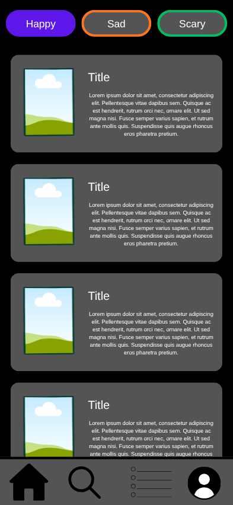
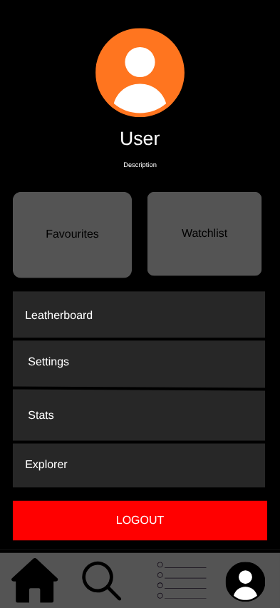
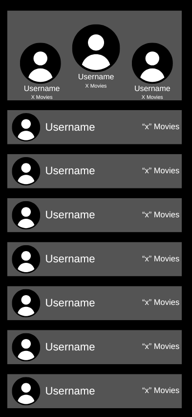

# Moovie

<p align="center">
  
</p>

<p align="center">
  
  
  
  
</p>

---

## 📖 Description

**Moovie** is anAndroid application that helps people discover films, track their watchlists and favorites, view interactive analytics, and explore nearby cinema locations. 

Is based on a **Offline-First architecture**, Moovie keeps all user data immediately available locally via Room and Preferences DataStore, while seamlessly synchronizing changes to a remote **Supabase** database.

---

## ✨ Key Features

- **🌐 Dynamic TMDB Scraping**: Seamlessly browse and search movies using the TMDB API.
- **🔄 Real-time Cloud Sync**: Synchronize user datas with Supabase.
- **🗺️ Cinema Explorer**: Interactive Maps showing nearby movie theaters and their details. 
- **📊 Interactive Analytics**: Data visualization showing movie tracking stats. with custom canvas
- **🏆 Social Leaderboard**: A gamified screen showing top Moovie community members with podium.
- **🔒 Biometric Security**: Safeguard your app content with an optional biometric lock.
- **🎨 Premium Visuals**: Custom theme and in-app notification banners.

---

## 🛠️ Tech Stack & Architecture

- **UI Framework**: Jetpack Compose (100% Declarative UI)
- **Dependency Injection**: Koin
- **Local Persistence**: 
  - **Room Database** (Movies catalog, favorites, watchlist cache)
  - **Preferences DataStore** (App settings, themes, language, biometric lock flag)
- **Network & API**: 
  - **Ktor** (HTTP requests)
  - **Supabase Kotlin SDK v3.0+** (Authentication, PostgreSQL Database, Cloud Storage)
- **Location & Mapping**: Google Maps SDK for Android & Fused Location Provider
- **Image Loading**: Coil (with cache-busting implementation)
- **Security**: Jetpack Biometric library

> [!TIP]
> For a detailed, visual overview of the application architecture, data flow diagrams, and offline-first synchronization strategy, check the **[Technical Architecture Documentation](docs/architecture.md)**.

---

## 🚀 Getting Started

### Prerequisites
1. Android Studio.
2. A Google Maps SDK for Android Api Key.
3. A TMDB API Key.
4. A Supabase Project URL and Public Anon Key.

### Configuration
Create a `local.properties` file in the root of the project and define your keys:
```properties
# TMDB API Configuration
TMDB_API_KEY=YOUR_TMDB_API_KEY

# Maps SDK for Android
MAPS_API_KEY=YOUR_GOOGLE_MAPS_API_KEY

# Supabase Client Configuration
SUPABASE_URL=https://YOUR_PROJECT_ID.supabase.co
SUPABASE_KEY=YOUR_SUPABASE_PUBLIC_ANON_KEY
```

### Build and Run
Clone the project, sync the Gradle configuration, and deploy to your Android device or emulator:
```bash
./gradlew assembleDebug
```

---

## 📸 Screenshots

Here is a glimpse of the app interface:

| Home & Mood Discovery | User Settings | Leaderboard Podium |
| :---: | :---: | :---: |
|  |  |  |

---

## 🛡️ License

This project is licensed under the MIT License - see the LICENSE file for details.
