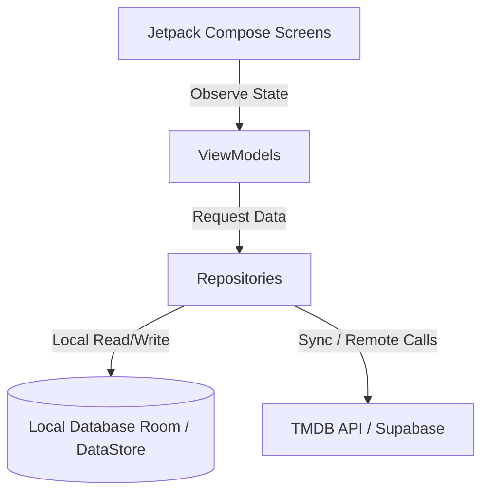
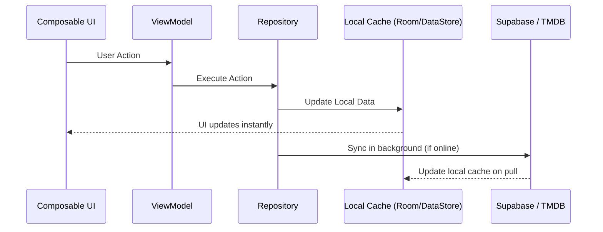

# Moovie - Application Architecture

Moovie is an Android application designed with an **Offline-First** approach. The app stores all user data locally to ensure optimal offline functionality, seamlessly synchronizing with **Supabase** in the background as soon as an internet connection is available.

---

## 1. Architecture Overview (MVVM + Clean Architecture)

The application separates concerns into three main logical layers:



* **UI (Compose):** Declarative screens and graphical components.
* **ViewModels:** Maintain the UI state and handle user interactions.
* **Repositories:** Act as the single source of truth. They read/write data locally and coordinate background synchronization with remote services.
* **Local Sources (Room & DataStore):** Room stores the movies database. DataStore stores user settings and mood counts.
* **Remote Sources (TMDB & Supabase):** TMDB provides movies metadata with search queries. Supabase handles user authentication, cloud database synchronization, and avatar storage.

---

## 2. Synchronization Flow (Offline-First)

The UI always reads from and writes to local databases. Remote synchronization is handled asynchronously in the background.



### Sync Details:
* **Authentication:** A pull operation is triggered upon login. Upon logout, all local data in Room and the cached profile picture are physically deleted for security.
* **Movies (Watchlist & Favorites):** Saved in the local Room database and synced asynchronously with the remote `user_movies` table on Supabase. A pull is performed automatically when logging in on a new device.
* **Profile Picture (Avatar):** 
  - **Offline**: The avatar is saved as a local file on the device and referenced using a `file://` URI (accessible offline).
  - **Online**: Uploaded to the Supabase Storage bucket. The public URL saved in the database profile is appended with a timestamp query parameter (e.g., `?t=123456`) to force Coil to bypass its cache and reload the image.
* **Mood Statistics:** Counts incremented locally in DataStore are upserted into Supabase (`user_moods`).

---

## 3. Package Structure

```
app/src/main/java/com/example/moovie/
├── MainActivity.kt      # Main entry Activity (manages theme, language context, etc.)
├── MoovieApp.kt         # Application class (initializes Koin dependency injection)
├── data/
│   ├── local/           # Room Database config, entities and DAOs.
│   ├── model/           # Shared domain models (Movie, Mood, etc.)
│   ├── remote/          # TMDB API Ktor client service interface and implementation
│   └── repository/      # Repositories & Sync Handlers (Supabase push/pull logic)
├── di/
│   └── AppModule.kt     # Koin module registering view models, services, and repositories
├── platform/
│   ├── biometric/       # BiometricService interface and platform implementation
│   └── location/        # LocationService for retrieving maps geo-coordinates
│   └── permissions/     # PermissionHandler for managing app permissions
├── presentation/        # ViewModels managing UI state, grouped by screen feature
└── ui/
    ├── components/      # Reusable Compose views (MovieListTemplate, notification banner, dialogs)
    ├── navigation/      # Navigation host (MoovieNavHost) and route definitions
    ├── screens/         # Compose screen entry points (HomeScreen, SettingsScreen, etc.)
    └── theme/           # UI styling configuration (colors, shapes, typography)
```
